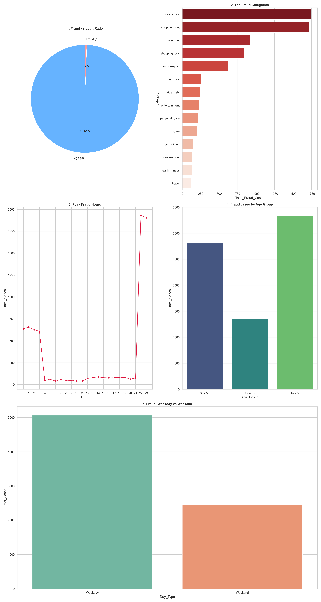
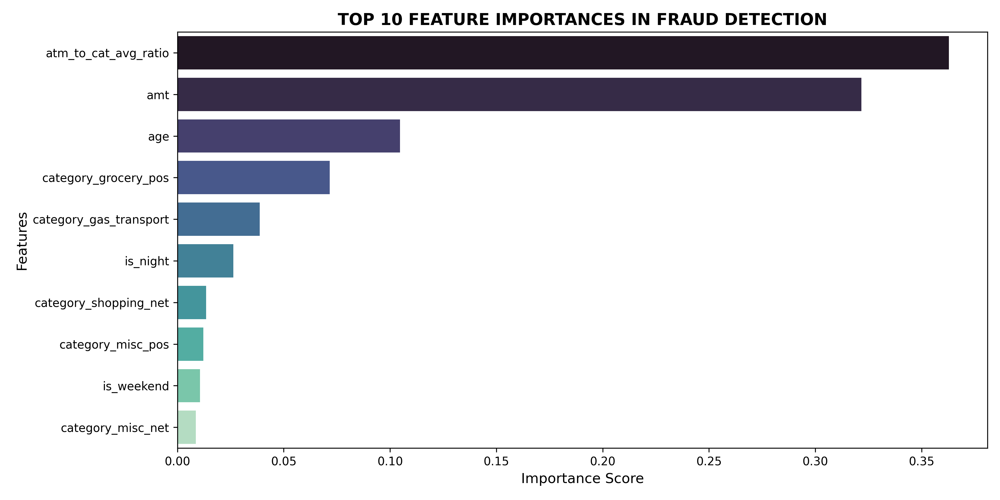

# Credit Card Fraud Detection System (End-to-End ML Pipeline)

## 1. PROJECT OVERVIEW
This project focuses on building an **End-to-End Credit Card Fraud Detection System** using Advanced Machine Learning algorithms. The primary objective is to automatically identify fraudulent transactions in real-time while minimizing false alarms for legitimate customers.

By leveraging a **data chunking pipeline**, the system efficiently processes large-scale financial data connecting **SQL Server** and **Pandas** smoothly, solving the hardware limitations and RAM overflow issues commonly encountered when working with Big Data on standard personal computers.

## 2. PROJECT WORKFLOW
The system is modularized into independent Python source files, corresponding to the standard phases of a real-world Data Science project:

```
[Raw CSV Data] 
       │
       ▼ (Step 1: main.py)
[SQL Server (Independent databases: fraud_train & fraud_test)]
       │
       ├─────────────────────────────────────────┐
       ▼ (Step 2: visualize_eda.py)             ▼ (Step 3: feature_engineering.py)
[Visualization & Pattern Discovery]      [Feature Engineering & Save Clean File]
                                                 │
                                                 ▼ (Step 4: train_model.py)
                                         [Model Training & Packaging AI (.pkl)]
                                                 │
                                                 ▼ (Step 5: evaluate_model.py)
                                         [Model Scoring & Validation on TEST Set]
```

## 3. DIRECTORY STRUCTURE & COMPONENT ROLES

### 3.1. DATA EXTRACTION AND LOADING (ETL) - `main.py`

* **Task:** Reads massive raw data from CSV files (`fraudTrain.csv`, `fraudTest.csv`) using a `chunksize=50000` mechanism. Utilizes `sqlalchemy` and `pyodbc` libraries configured for high-speed data loading (`fast_executemany=True`) into SQL Server.

* **Technical Highlight:** Completely separates the data stream right from the source into two independent tables: `fraud_train` (for training) and `fraud_test` (for independent evaluation), entirely eliminating the risk of Data Leakage.

### 3.2. EXPLORATORY DATA ANALYSIS (EDA) - `SQLQuery_EDA.sql` & `visualize_eda.py`

* **Task:** The SQL file performs an in-depth analysis of 8 security-related business questions (imbalance ratio, geographical hotspots, high-risk categories...). The Python script connects to SQL Server, using Matplotlib and Seaborn to visualize behavioral segments and exports them into a consolidated image `visualize_eda.jpg`.


* **Discovered Patterns:** Fraudulent activities show a strong tendency to spike during critical late-night hours (11 PM - 3 AM), targeting physical point-of-sale (POS) shopping categories like grocery and gas/transportation, and concentrating heavily within specific age groups.

### 3.3. Feature Engineering - `feature_engineering.py`

* **Task:** Reads data incrementally (in chunks of 200,000 rows) from the `fraud_train` table, processing timestamps and categorical attributes into smart numerical variables that the AI can easily interpret, exporting the results to `fraud_processed_full.csv`.

* **Advanced Engineered Behavioral Features:**
  * `age`: The cardholder's age at the exact time of the transaction.
  * `hour`: The hour of the day the transaction was made.
  * `is_night`: A binary flag (1 if the transaction occurred between 11 PM and 3 AM when cardholders are usually asleep; 0 otherwise).
  * `is_weekend`: A binary flag (1 if the transaction took place on Saturday or Sunday).
  * `atm_to_cat_avg_ratio`: The ratio of the current transaction amount divided by the historical average spending of that specific category (The golden key to detecting unusual spending spikes).

* **Technical Highlight:** Applies One-Hot Encoding using `pd.get_dummies()`. Enforces the categorical structure through a master category list using `pd.Categorical` fetched directly from SQL Server, preventing any matrix shape mismatch errors when appending data incrementally.   

### 3.4. Model Training and Packaging - `train_model.py`

* **Task:** Loads the first 300,000 clean records, performs an 80% (Train) and 20% (Validation) split while preserving class proportions (`stratify=y`). It organizes a sòng phẳng (fair) head-to-head performance tournament between **Random Forest** and **LightGBM**.

* **Packaging & Interpretation:** The winning model based on the `Combo_Score` (**Random Forest**) is packaged into a binary file `fraud_best_ai_model.pkl` using `joblib`. It also extracts the mathematical attribute `rf_model.feature_importances_` to plot the `fraud_feature_importance.png` bar chart, deconstructing the internal logic of the AI brain.

### 3.5 Production Final Evaluation - `evaluate_model.py`

* **Task:** Loads the `fraud_best_ai_model.pkl` model. Pulls a fresh batch of 100,000 transactions from the `fraud_test` table in SQL Server to serve as the final exam for the AI.

* **Technical Highlight:** Employs an advanced structural protection layer using Pandas `.reindex(columns=..., fill_value=0)`. This mechanism automatically matches expected features, eliminating unseen categories from production inputs and filling missing columns with 0, ensuring the system operates robustly without crashing due to matrix shape errors.

## 4. MODEL PERFORMANCE & EVALUATION
The system conducted an independent evaluation on a fresh batch of **100,000 completely new transactions** from the `fraud_test` table in SQL Server. Below are the detailed final validation results of the core Random Forest model:

### 4.1. Performance Comparison Table (Validation Set)
Before packaging the AI model, the system hosted a performance evaluation on a validation dataset of 60,000 records to compare the two powerful classification models:

| Model | Accuracy | Precision | Recall | F1-Score | ROC-AUC | **Combo_Score** |
| :--- | :---: | :---: | :---: | :---: | :---: | :---: |
| **Random Forest** | 0.9976 | 0.8154 | 0.6851 | 0.7452 | 0.9707 | **0.8579** |
| **LightGBM** | 0.9949 | 0.5076 | 0.5372 | 0.5220 | 0.8884 | **0.7052** |

> **Selection Criteria:** The system utilizes a consolidated metric **`Combo_Score = (F1-Score + ROC-AUC) / 2`** as the ultimate benchmark to simultaneously optimize the system's ability to catch fraudsters while keeping false alarms under control. **Random Forest** emerged as the clear winner with a superior score (**0.8142** compared to 0.7578) and was chosen as the core engine.

### 4.2. Final Performance Metrics on the TEST Set

Independent testing of the Random Forest model on **100,000 completely new and unseen transactions** from the `fraud_test` database table yielded:

| Evaluation Metric | Value | Business Meaning in Banking Security |
| :--- | :---: | :--- |
| **Accuracy** (Overall Accuracy) | **0.9976** | Accurately classifies 99.76% of the entire data landscape in the TEST set. |
| **Precision** (True Alarm Rate) | **0.7492** | When the AI triggers a red alert, there is a ~75% probability that the transaction is truly fraudulent. This dramatically minimizes false card blocks. |
| **Recall** (Fraud Detection Rate) | **0.6095** | The AI successfully flags and catches nearly 61% of all actual fraudulent cases occurring in the real world. |
| **F1-Score** (System Balance Score) | **0.6722** | The harmonic mean score, proving the model achieves an ideal, stable state between catching thieves and protecting honest users. |
| **ROC-AUC** (Global Intelligence) | **0.9561** | Close to the absolute maximum (1.0), proving that the custom engineered behavioral features possess highly distinct predictive power to separate criminals from genuine customers. |

### 4.3. Confusion Matrix
Detailed counts of correct/incorrect classifications by Random Forest on the 100,000 real-world test transactions:

| Actual \ AI Predicted | **Approve (Legit)** | **Alert (Fraud)** |
| :--- | :---: | :---: |
| **Actual LEGIT** | **99,516** (True Negative - TN) <br> *Processed smoothly; zero friction for honest customers.* | **82** (False Positive - FP) <br> *False alarm! Genuine customer blocked incorrectly.* |
| **Actual FRAUD** | **157** (False Negative - FN) <br> *Missed fraud! Criminal slipped through.* | **245** (True Positive - TP) <br> *Caught successfully! Prevented financial loss.* |

> **In-depth Analysis:** The False Positive Rate over the entire test volume is exceptionally low (~0.08%). This is highly valuable for bank operations: it prevents the Customer Service department from being overwhelmed by complaints regarding accidental card blocks, thereby saving operational costs while fully securing funds against 245 real fraudulent attacks.

## 5. UNDERSTANDING THE AI LOGIC (FEATURE IMPORTANCE)
Based on the mathematical weights visualized from the Random Forest model:


1. **`atm_to_cat_avg_ratio` (~36%) and `amt` (~32%):** Together, they hold nearly **70% of the total decision-making power** of the AI. This confirms that the core pattern of credit card fraud lies in spending unusually large amounts that deviate heavily from historical category averages.
2. **`age` (~10.5%):** The customer's age stands out as the third most critical variable, showing that fraudsters explicitly tailor their attack scenarios based on the victim's demographic profile.
3. **`category_grocery_pos` & `category_gas_transport`:** These two physical point-of-sale quẹt thẻ (card swiping) categories are heavily targeted by the AI, as criminals look for rapid asset liquidation at grocery and gas stations.
4. **`is_night`:** Contributes significantly to sharpening the model's sensitivity during vulnerable late-night hours.

## 6. INSTALLATION & SETUP GUIDE

### Prerequisites
* Clone Project: git clone https://github.com/TranKhoa895/Credit-Card-Fraud-Detection-System.git
* Python version `3.10` or higher.
* Microsoft SQL Server instance (configured with Windows Authentication or equivalent credentials).
* Connection Driver: `ODBC Driver 17 for SQL Server`.

### Virtual Environment Setup and Installation
```
# Create an independent virtual environment
python -m venv .venv

# Activate the virtual environment (Windows)
.venv\Scripts\activate

# Install core library packages
pip install pandas numpy scikit-learn lightgbm matplotlib seaborn sqlalchemy pyodbc joblib
```

### Execution Order Workflow
```
# Step 1: Load raw data into SQL Server
python main.py

# Step 2: Extract raw EDA visualizations
python visualize_eda.py

# Step 3: Process behavioral features and export the clean dataset
python feature_engineering.py

# Step 4: Run the machine learning tournament, plot feature importance, and package model
python train_model.py

# Step 5: Execute final validation exam against the unseen Test set in SQL Server
python evaluate_model.py
```

The project is completed following strict End-to-End industrial standards, featuring an optimized memory footprint and high model sensitivity, ready to be deployed into secure payment gateway environments.
